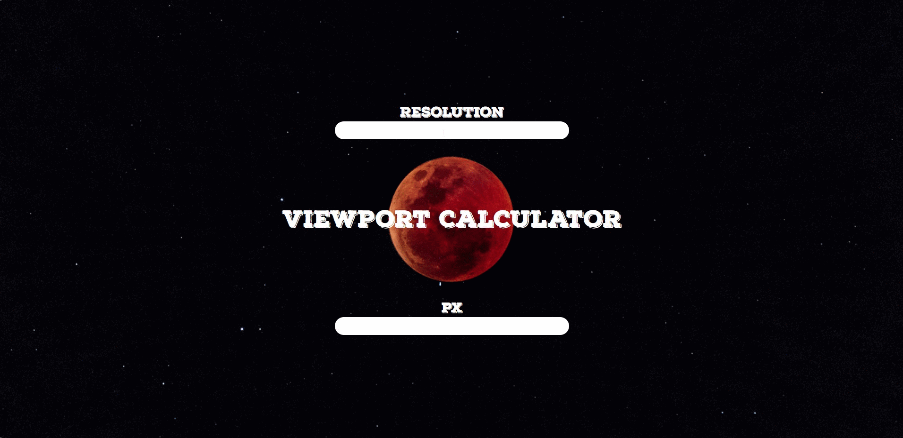

<h1>Px2Viewport</h1>

This little tool will help you convert **pixels** into **viewport units**.
<<<<<<< HEAD
=======

>>>>>>> b4af62c1bf419ebe8f35d8f8a062ffa8f5d8f037
If you want learn more about viewport units [this](https://tutorialzine.com/2015/05/simplify-your-stylesheets-with-the-magical-css-viewport-units) might help you.

<h2>Install</h2>

To install Px2Viewport you can simply _Clone or download_ this repo.

<h2>Usage</h2>

Get to your _cloned or downloaded_ Px2Viewport folder and open **index.html**.
* Now you must enter needed screen width or heigth value.
* Last thing to do is enter pixels value. 

<h2>Contact</h2>

My contacts:
* numkied@gmail.com

<h2>License</h2>

**The MIT License (MIT)**
<<<<<<< HEAD
Copyright © 2020 NumKied
=======

Copyright © 2020 NumKied
>>>>>>> b4af62c1bf419ebe8f35d8f8a062ffa8f5d8f037
